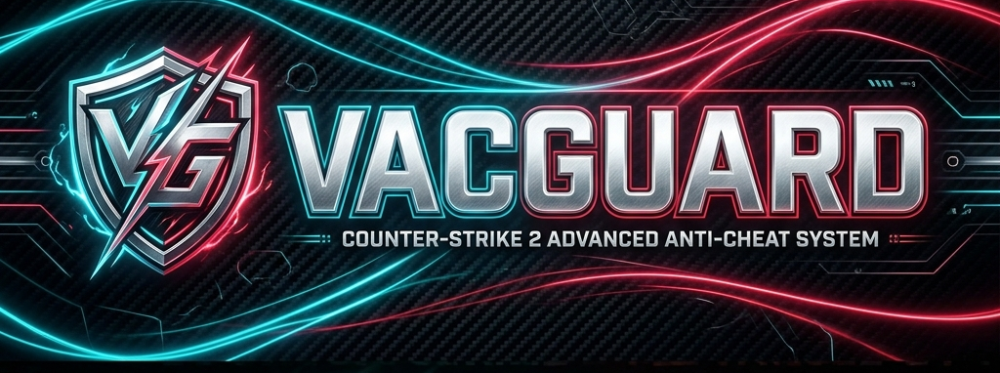

<div align="center">

# 

### Aegis-X — Next-generation Pure Client-Side Anti-Cheat Suite for Counter-Strike 2 by Sahil.

[](https://github.com/1nOnlySahil)
[](#quickstart)
[](#pure-client-side-protection-daemon-aegisx_guardexe)
[](#the-seventeen-detection-modules)
[](#quickstart)
[](LICENSE)

**Counter-Strike is at its best when every shot, clutch, and win is earned.**

Aegis-X Suite (by Sahil) operates as an unbypassable, pure client-side anti-cheat daemon (`AegisX_Guard.exe`) that protects players and servers in real-time.

[Install](#quickstart) · [Pure Client Protection](#pure-client-side-protection-daemon-aegisx_guardexe) · [See every detection](#the-seventeen-detection-modules) · [Fog-Of-War Anti-Wallhack](#fog-of-war-protection) · [Credits](#credits)

</div>

<details>
<summary><strong>Click to view detection showcase GIFs (See it catch)</strong></summary>

<br>

<table>
<tr>
<td width="50%" align="center">

<br><strong>AIMBOT</strong><br>
<sub>A blatant snap lands on target.</sub>
</td>
<td width="50%" align="center">

<br><strong>AIMLOCK</strong><br>
<sub>The crosshair follows a moving target with inhuman precision.</sub>
</td>
</tr>
<tr>
<td width="50%" align="center">

<br><strong>ANTIAIM</strong><br>
<sub>Impossible angles, attack-return, jitter, and spin patterns.</sub>
</td>
<td width="50%" align="center">

<br><strong>BHOP</strong><br>
<sub>Repeated frame-perfect hops and machine-like jump patterns.</sub>
</td>
</tr>
<tr>
<td width="50%" align="center">

<br><strong>IRREGULAR BEHAVIOR</strong><br>
<sub>Too many rage-level airborne and no-scope results.</sub>
</td>
<td width="50%" align="center">

<br><strong>SILENTAIM</strong><br>
<sub>The bullets hit somewhere the visible aim never pointed.</sub>
</td>
</tr>
</table>

</details>

<div align="center">

### CS2AC + CS2FOW

<a href="https://github.com/karola3vax/CS2FOW">

</a>

**Catch the cheat. Starve the wallhack.**

<sub>CS2AC catches cheating behavior. CS2FOW stops hidden enemies from being sent to the cheater in the first place, and culls local client memory to blind external wallhacks.</sub>

</div>

## Pure Client-Side Protection Daemon (`AegisX_Guard.exe`)

Aegis-X operates as a **100% stand-alone client-side anti-cheat daemon** (`AegisX_Guard.exe`) running natively on the player's system (Faceit / ESEA style) with zero server plugin dependencies required for client security.

- **CS2 Auto-Detect Daemon ([client_main.cpp](file:///e:/cs2%20anticheats/CS2AC_FOW/src/client_main.cpp))**: Automatically monitors system process tables (`< 200ms` response) and initializes full security scanning the instant `cs2.exe` launches.
- **Unbypassable Process Self-Protection ([anti_tamper.cpp](file:///e:/cs2%20anticheats/CS2AC_FOW/src/anti_tamper.cpp))**: Enforces restrictive Kernel Security Descriptors (DACLs) stripping `PROCESS_TERMINATE`, `PROCESS_VM_READ`, and `PROCESS_VM_WRITE` rights from external task managers or cheat injectors. Enforces `MicrosoftSignedOnly` thread policies.
- **Heartbeat Watchdog & Anti-Suspension ([watchdog.cpp](file:///e:/cs2%20anticheats/CS2AC_FOW/src/watchdog.cpp))**: Encrypted multi-threaded watchdog that monitors tick deltas (`GetTickCount64`). Immediately terminates `cs2.exe` if Aegis-X is frozen, paused, or suspended by a cheat debugger (`> 2000ms`).
- **PCIe DMA Hardware Card Shield ([dma_shield.cpp](file:///e:/cs2%20anticheats/CS2AC_FOW/src/dma_shield.cpp))**: Scans PCIe bus configuration spaces using `SetupAPI` for hardware DMA memory cards (CaptainDMA, EnigmaDMA, Screamer, Xilinx FPGA boards).
- **Hypervisor CPUID Timing Verifier ([hypervisor_detector.cpp](file:///e:/cs2%20anticheats/CS2AC_FOW/src/hypervisor_detector.cpp))**: Measures CPU cycle latency across `CPUID` calls (`RDTSC`) to detect Type-1 / Type-2 Hypervisors (VT-x, BluePill) forcing VM-Exits (`> 800 cycles`).
- **AI Computer Vision Capture Scanner ([ai_cv_detector.cpp](file:///e:/cs2%20anticheats/CS2AC_FOW/src/ai_cv_detector.cpp))**: Detects DXGI Desktop Duplication API (`IDXGIOutputDuplication`) frame capture hooks used by YOLO / AI vision aimbots.
- **Client Memory Fog-Of-War ([client_fow.cpp](file:///e:/cs2%20anticheats/CS2AC_FOW/src/client_fow.cpp))**: Zeroes out enemy player coordinates (`Vector(0,0,0)`) in client memory, keeping external ESP wallhacks, DMA cards, and radars 100% blind until players enter line-of-sight.

## The Seventeen Detection Modules

### Aim and accuracy

**Aimbot.** The player's aim moves sharply onto an enemy before a damaging shot. CS2AC checks whether this pattern occurs across separate shots.

**Aimlock.** The player's aim closely follows a moving enemy for an extended period. CS2AC measures how closely the aim follows the target over time, including when the target is behind a wall.

**Silentaim.** A damaging bullet lands away from the direction shown by the player's aim. CS2AC compares the aim at the moment of the shot with the bullet impact and resulting damage.

**Inhuman Accuracy.** The player maintains an unusually high hit rate across a longer series of aimed shots. CS2AC tracks those shots and how many of them cause damage.

**Irregular Behavior.** The player repeatedly lands difficult shots while airborne or without using a sniper scope. CS2AC counts both successful and missed attempts over time.

### Movement

**Autostrafe.** The player repeatedly gains or preserves speed through highly consistent movement while airborne. CS2AC compares the player's movement, speed, and timing across each jump.

**Bhop.** The player repeatedly jumps again as soon as they touch the ground. CS2AC measures the time between landing and the next jump across consecutive hops.

**Hyperscroll.** The player sends unusually rapid bursts of jump inputs while landing. CS2AC checks those inputs together with the timing of the resulting jumps.

**Nulls.** The player switches between opposite movement directions with highly consistent timing while airborne. CS2AC compares the movement keys with the direction changes sent by the player.

### Exploits and client behavior

**Antiaim.** The player's view spins, jitters, returns after an attack, or reaches angles outside normal play. CS2AC checks the view angles and their order across consecutive commands.

**DLL Injection.** The player's game subscribes to a group of events associated with injected client code. CS2AC checks those event subscriptions after the player joins and again while they remain connected.

**Desubticking.** The player's movement inputs repeatedly arrive without their normal timing between ticks. CS2AC checks the timing attached to each movement change.

**Doubletap.** The same weapon fires twice before its normal delay has passed. CS2AC compares the weapon and server tick of each consecutive shot.

**Invalid CVar.** The player's game reports a protected or monitored setting outside its accepted value. CS2AC requests these settings from the client and checks each reply.

**Invalid Input.** The player's button state does not match the recorded order of button presses and releases. CS2AC compares both parts of the command sent by the client.

**Namechanger.** The player changes their visible name repeatedly within a short period. CS2AC counts name changes for each connected player.

**Subtick Spam.** The player repeatedly sends many movement or aim changes at the same point within a tick. CS2AC checks how often these same-time input bursts occur.

## Fog-Of-War Protection

**CS2FOW** prevents wallhacks (ESP), DMA cards, and 2nd-device web radars from seeing enemy players:
- **Server Netmasking**: Stops sending live player positions when occluded behind solid walls or smoke.
- **Client Memory Culling**: For hidden players, coordinate memory vectors are zero-masked (`Vector(0,0,0)`), rendering external wallhacks (ESP), DMA cards, and web radars 100% blind until the player emerges into line-of-sight.

## One detection. Everywhere.

When CS2AC acts, it can do all of this at once:

1. Announce the detection in public chat.
2. Hold a clear center-screen alert for five seconds.
3. Write the evidence and punishment result to the server console.
4. Run your configured ban or kick command.
5. Send a detailed Discord webhook report.

```text
[CS2AC] detected AIMBOT on Player and punished.
```

<div align="center">


<table>
<tr>
<td width="33%" align="center">

<br><strong>Five-second center alert</strong>
</td>
<td width="33%" align="center">

<br><strong>Detection sent</strong>
</td>
<td width="33%" align="center">

<br><strong>Whitelist stays visible</strong>
</td>
</tr>
</table>

</div>

Whitelisting does not silence CS2AC. The detection still appears in chat, on screen, in the console, and in Discord; only the punishment command is skipped.

## Quickstart

You need a Windows x64 or Linux x64 CS2 dedicated server running [Metamod:Source](https://www.sourcemm.net/) 2.x.

1. Open this repository's **Releases** tab and choose the matching Windows or Linux package.
2. Extract it into the CS2 server root without rearranging anything. The package begins with the `game` folder.
3. Edit `game/csgo/cfg/cs2ac.cfg`.
4. Start the server.
5. Run `meta list`, then `cs2ac_status`.

That is it. Players install nothing for server-side mode, or can launch `CS2AC_FOW_Guard.exe` for client-side protection.

The default punishment commands are made for [CS2-SimpleAdmin](https://github.com/daffyyyy/CS2-SimpleAdmin). Using another admin plugin? Replace the two commands in `cs2ac.cfg` with commands that plugin understands.

## Configuration

The included [`cs2ac.cfg`](cfg/cs2ac.cfg) explains every option in plain language.

| Setting | Default | What it does |
| --- | ---: | --- |
| `cs2ac_enabled` | `1` | Master switch for CS2AC. |
| `cs2ac_whitelist` | empty | SteamID64s that may be detected but must never be punished. |
| `cs2ac_*_enabled` | `1` | Enable or disable one detection module. |
| `cs2ac_chat_announcements` | `1` | Show detections in public chat. |
| `cs2ac_center_announcements` | `1` | Show the five-second center alert. |
| `cs2ac_language` | `en` | Language used for public messages and Discord reports. |
| `cs2ac_punishment_command` | `css_addban ...` | Command used for permanent bans. |
| `cs2ac_kick_command` | `css_kick ...` | Command used for kick-only detections. |
| `cs2ac_webhook_url` | empty | Discord webhook that receives detection reports. |
| `cs2ac_webhook_role_id` | empty | Discord role to mention on a report. |
| `cs2ac_webhook_server_address` | automatic | Server address shown in Discord. |
| `cs2ac_allow_sv_cheats_testing` | `0` | Allow local detector testing with `sv_cheats 1`. Never enable this on a public server. |

Punishment commands support `{steamid64}`, `{userid}`, and `{detection}`:

```cfg
cs2ac_punishment_command "css_addban {steamid64} 0 CS2AC: {detection}"
cs2ac_kick_command "css_kick #{userid} CS2AC: {detection}"
```

Whitelist one account or a comma-separated list:

```cfg
cs2ac_whitelist "76561198000000001,76561198000000002"
```

Set `cs2ac_language` to one of the bundled language codes, then run `cs2ac_reload`:

`ar`, `bg`, `cs`, `da`, `de`, `el`, `en`, `es-419`, `es-es`, `et`, `fi`, `fr`, `he`, `hr`, `hu`, `id`, `it`, `ja`, `ko`, `lt`, `lv`, `nl`, `no`, `pl`, `pt-br`, `pt-pt`, `ro`, `ru`, `sk`, `sr`, `sv`, `th`, `tr`, `uk`, `vi`, `zh-cn`, `zh-tw`.

### Discord in four steps

1. Create a webhook in the Discord channel that should receive detections.
2. Put its URL in `cs2ac_webhook_url`.
3. Run `cs2ac_reload`.
4. Run `cs2ac_webhook_test`.

Keep the webhook URL private. CS2AC never prints it back to the console.

<div align="center">

</div>

<details>
<summary><strong>Server commands</strong></summary>

| Command | What it does |
| --- | --- |
| `cs2ac_status` | Show whether CS2AC and its main features are working. |
| `cs2ac_help` | List the available CS2AC commands. |
| `cs2ac_reload` | Reload `cs2ac.cfg`. |
| `cs2ac_check_config` | Find mistakes in the current configuration. |
| `cs2ac_test_announcement` | Preview the chat and center-screen alert without detecting anyone. |
| `cs2ac_webhook_test` | Send a test detection report to Discord. |

</details>

## FAQ

<details>
<summary><strong>Do players install anything?</strong></summary>

For server-side operation, nope. CS2AC lives entirely on the dedicated server. For full client-side protection against internal hooks and external overlays, players can run `CS2AC_FOW_Guard.exe`.

</details>

<details>
<summary><strong>Does it work in Premier or Valve matchmaking?</strong></summary>

No. CS2AC is made for community and dedicated servers you control, or client-side custom launcher protection. It cannot be added to official Valve matchmaking.

</details>

<details>
<summary><strong>Can it catch every cheat?</strong></summary>

No anti-cheat catches everything. CS2AC judges behavior that reaches the server or client monitor, blocking internal hooks, unbacked RWX pages, transparent overlays, and zeroing occluded player coordinates.

</details>

<details>
<summary><strong>Which detections ban and which only kick?</strong></summary>

By default, Desubticking, Nulls, and Subtick Spam only kick. Every other detection uses the permanent-ban command.

Want different punishments? Change or empty either command. The detection announcements will keep working.

</details>

<details>
<summary><strong>What happens to whitelisted players?</strong></summary>

They can still trigger a detection, and everyone can still see it, but CS2AC stops before sending any punishment command.

</details>

<details>
<summary><strong>Does it support FFA?</strong></summary>

Yes. When `mp_teammates_are_enemies` is enabled, CS2AC treats other players as enemies just like the game does.

</details>

<details>
<summary><strong>Does CS2AC advertise itself?</strong></summary>

Yes, but it does not spam. Every six completed rounds, CS2AC shows this message once in chat and at the center of the screen:

```text
[CS2AC] This server is protected by karola3vax's anti-cheat.
```

This small project credit is built in and cannot be turned off.

</details>

## Building from source

Clone the repository:

```sh
git clone --recursive https://github.com/sahilneverdies/Aegis-X.git
cd Aegis-X
```

### Client Guard Executable (`AegisX_Guard.exe`)
Build on Windows using CMake and MSVC:

```powershell
cd Aegis-X
mkdir build
cd build
cmake ..
cmake --build . --config Release
```

### Server Plugin (`cs2ac.dll` / `cs2ac.so`)
Windows needs Python 3.8 or newer and Visual Studio 2022 with the C++ workload:

```sh
python configure.py
ambuild
```

## Credits

All original detection logic, BVH8 spatial raycasting algorithms, gamedata offsets, and showcase demonstrations are created and maintained by **[karola3vax](https://github.com/karola3vax)**.

- **[CS2AC Repository](https://github.com/karola3vax/CS2AC)**
- **[CS2FOW Repository](https://github.com/karola3vax/CS2FOW)**
